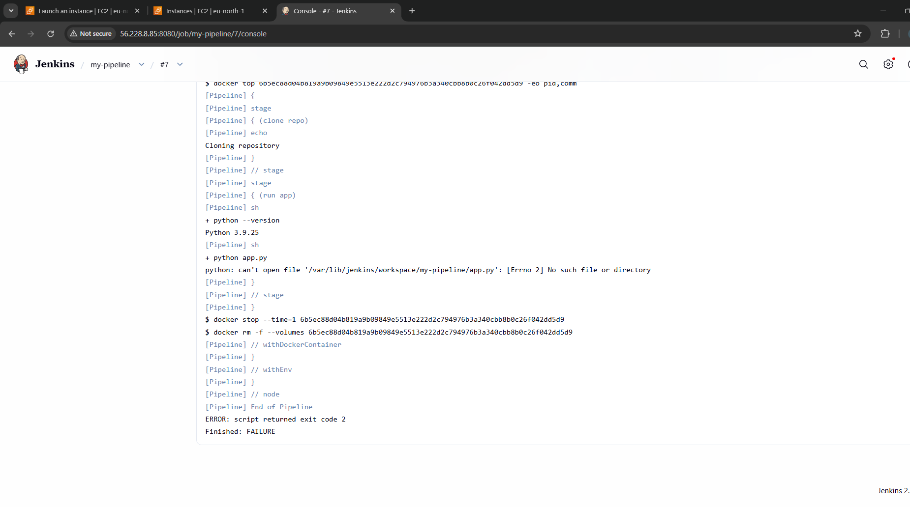

# Jenkins CI pipeline using docker as agent 

## Project Overview 
This project demonstrates how to use **Docker agent in jenkins pipeline** to run in an isolated an 
consistent environment .Each jenkins build run inside a docker container , ensuring dependencies consistency and clean environment. 

## Technologies used 
- Jenkins 
- Docker
- Github 
- Python

## Key learnings 
- Install jenkins and docker on your system
- Create a new jenkins pipeline job
- Conne ct your guthub repoaitory with SCM (Source code management)
- Add the jenkinsfile
- Run the pipeline 

##  Error Encountered & Resolution

###  Issue
During pipeline execution, the build failed with the following error:

```text
python: can't open file '/var/lib/jenkins/workspace/my-pipeline/app.py':
[Errno 2] No such file or directory
```

###  Root Cause
Jenkins executes pipeline steps from the workspace root directory by default.  
However, the application file `app.py` was located inside a subdirectory:

```text
docker-agent-demo/app.py
```

Since Jenkins does not automatically navigate into subdirectories, the file could not be found during execution.

### Solution
The issue was resolved by using the `dir()` step in the Jenkinsfile to change into the correct directory before executing the script.

```groovy
dir('docker-agent-demo') {
    sh 'python app.py'
}
```

This ensured that Jenkins executed the script from the correct path inside the Docker agent.

## Jenkins pipeline output 



## Container creation 


